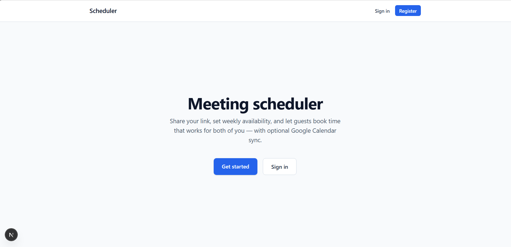
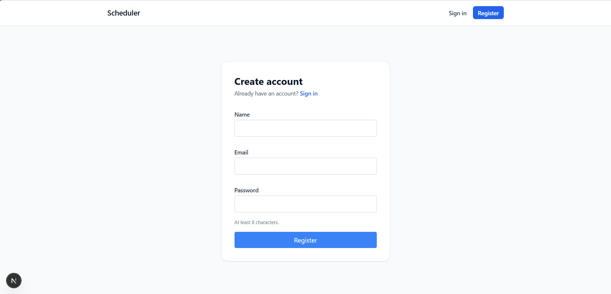
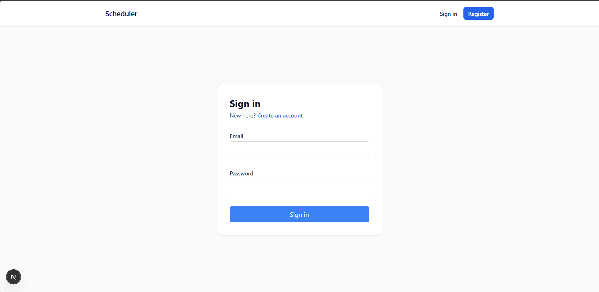
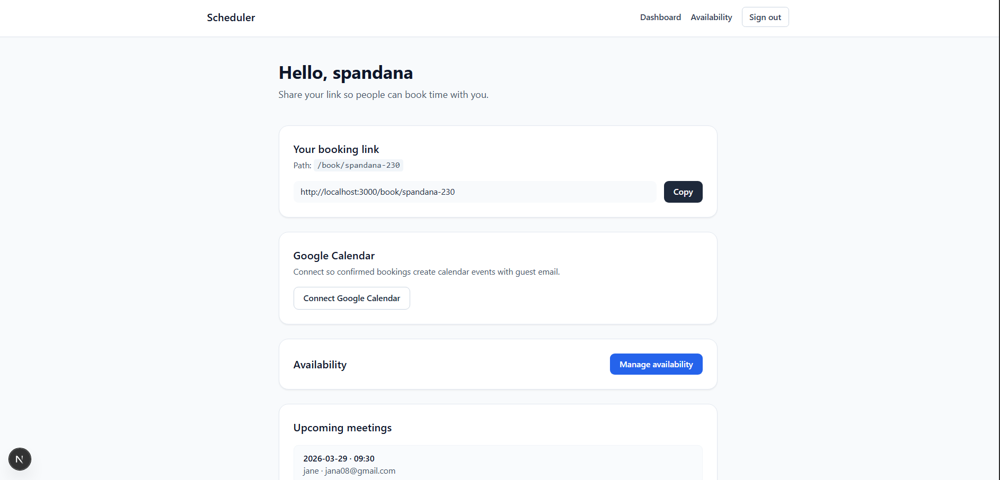
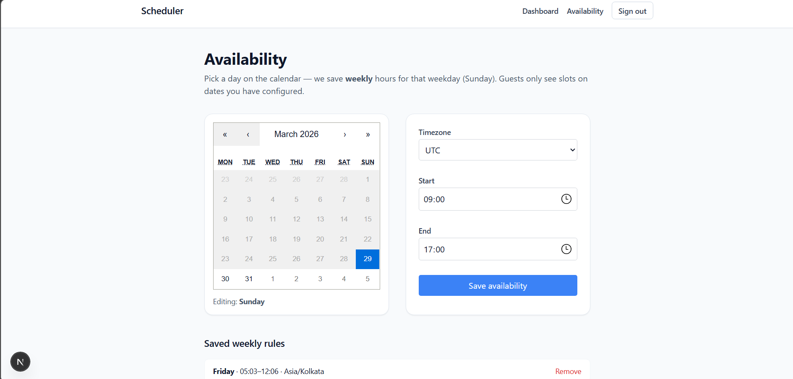
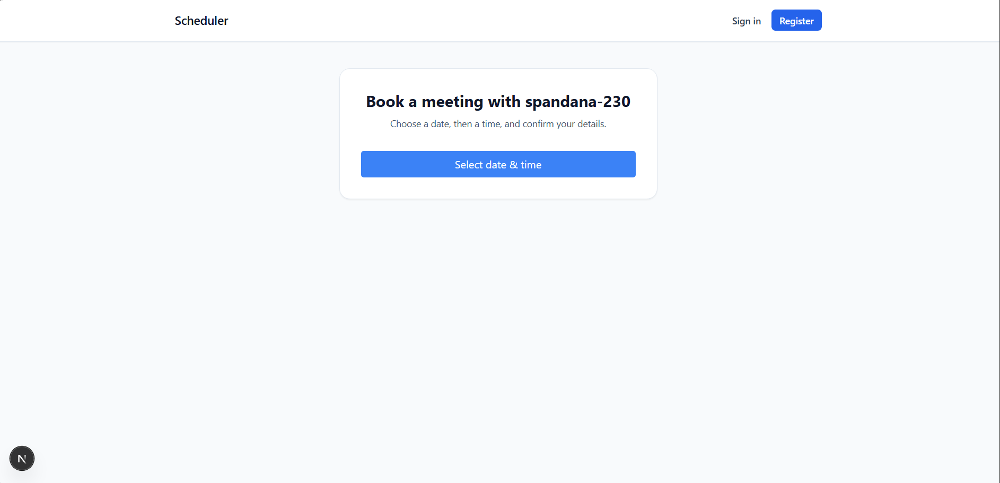
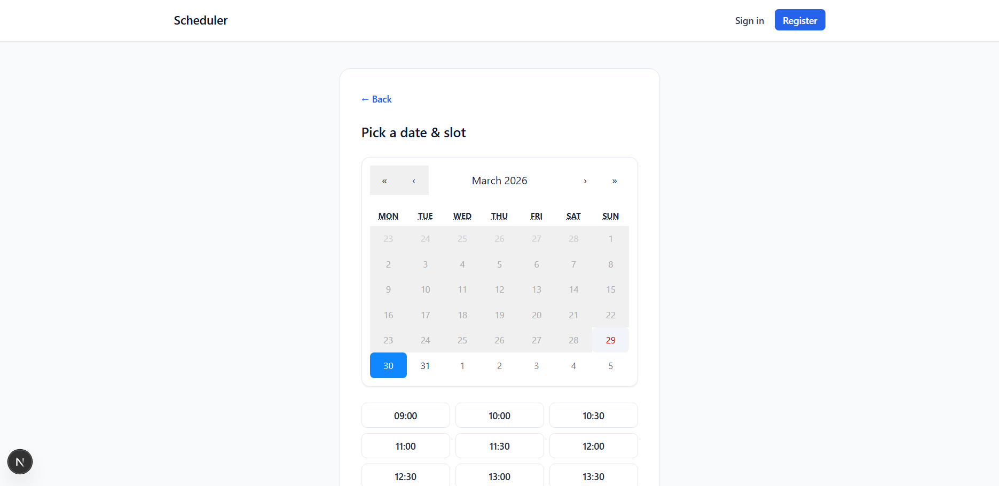
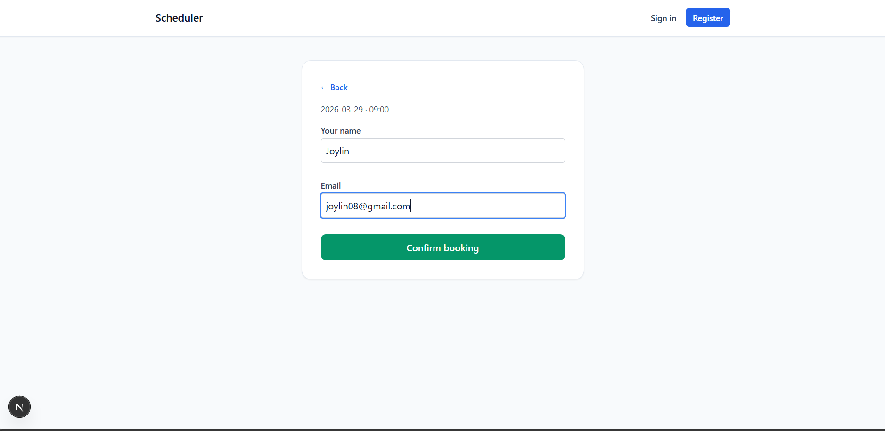
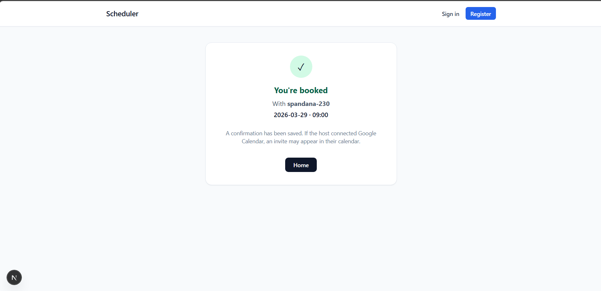

📅 Scheduler App (Calendly-Style Booking Platform)

A full-stack scheduling application where users can create availability and allow others to book meetings using a shared link.

When a meeting is booked, an event is automatically created in Google Calendar.

This project replicates core features of Calendly.

✨ Features
🔐 Authentication
User authentication using Email & Password
Implemented with NextAuth.js

Users can:

Register
Login
Logout
Access protected dashboard
👤 User Dashboard

After login, users can:

Manage availability
View booking links
Share scheduling page
📅 Availability Management

Users can define:

Available days
Start time
End time
Meeting duration
🔗 Public Booking Page

Users receive a public booking URL like:

/book/username

Guests can open this page and book a meeting.

🗓 Meeting Booking

Guests can:

Select a date
Choose an available time slot
Enter their name and email
Confirm booking
📆 Google Calendar Integration

Once a meeting is booked:

An event is automatically created in Google Calendar
Guest email is added as an attendee
Meeting appears in the host's calendar
🛠 Tech Stack
Frontend
Next.js
React
Tailwind CSS
Backend
Next.js API Routes
Node.js
Authentication
NextAuth.js>
Credentials Provider (Email + Password)
Database
MongoDB
APIs
Google Calendar API
Deployment
Vercel
⚙️ How It Works
1️⃣ User Registration

Users create an account using:

Email
Password
Username
2️⃣ Login

Users log in using credentials.

Email + Password → Dashboard
3️⃣ Set Availability

Users configure:

Days available
Time slots
Meeting duration
4️⃣ Share Booking Link

Each user gets a unique link:

https://yourapp.com/book/username

Guests use this link to book meetings.

5️⃣ Booking Flow
Guest selects date
      ↓
Guest selects time slot
      ↓
Guest enters name & email
      ↓
Booking stored in database
      ↓
Google Calendar event created
📂 Project Structure
app
 ├ api
 │   ├ auth
 │   ├ availability
 │   ├ booking
 │   ├ slots
 │   └ google
 │
 ├ dashboard
 ├ availability
 ├ book/[username]
 ├ login
 └ register

components
 ├ Navbar
 ├ CalendarPicker
 ├ Providers

lib
 ├ auth
 ├ db
 ├ google-calendar
 ├ slots

models
 ├ User
 ├ Availability
 └ Booking
🧪 Local Setup
Clone Repository
git clone https://github.com/yourusername/scheduler.git
cd scheduler
Install Dependencies
npm install
Setup Environment Variables

Create .env.local

NEXTAUTH_SECRET=
NEXTAUTH_URL=http://localhost:3000

MONGODB_URI=

GOOGLE_CLIENT_ID=
GOOGLE_CLIENT_SECRET=
GOOGLE_REFRESH_TOKEN=
Run Development Server
npm run dev

Open:

http://localhost:3000
🌍 Deployment

Deploy easily using Vercel.

## 📸 Screenshots

### Home Page

### Register Page

### Login Page

### Dashboard

### Set Availability

### Booking Page

### GuestBooking Page

### ConfirmBooking Page

### Bookingsuccess Page

Steps:

Push project to GitHub
Import repository into Vercel
Add environment variables
Deploy
📌 Future Improvements
Email confirmations for bookings
Prevent double booking
Google Meet link generation
Meeting reminders
Timezone detection
Admin analytics dashboard
👩‍💻 Author

Spandana M J

Built as a scheduling system inspired by Calendly.

⭐ If you like this project, please star the repository.